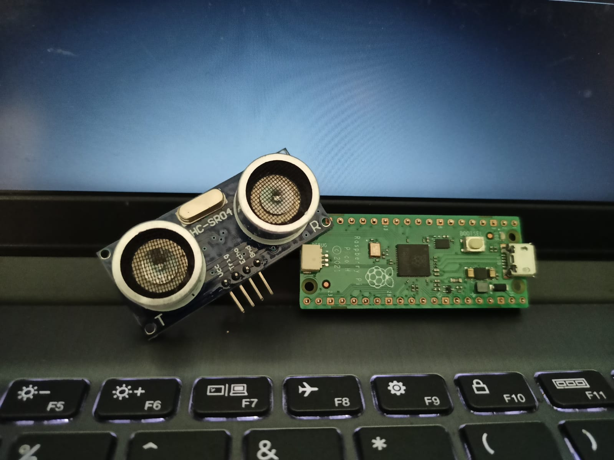

# HC-SR04 Ultrasonic Sensor Integration with MicroPython  
  

## Overview  

This repository provides a lightweight MicroPython implementation for interfacing with the **HC-SR04 Ultrasonic Sensor**, a widely used device for distance measurement in DIY electronics projects. The code demonstrates how to accurately measure distances using a trigger and echo mechanism and is tailored for efficiency on MicroPython-compatible boards.

---

## Features  
- Simple and lightweight design for easy integration.  
- Measures distances with accuracy up to a few centimeters.  
- Built-in handling for timeouts to ensure robust measurements.  

---

## Prerequisites  

### Hardware Required  
1. **HC-SR04 Ultrasonic Sensor**  
2. A MicroPython-compatible microcontroller (e.g., ESP8266, ESP32, Raspberry Pi Pico).  
3. Jumper wires.  
4. Breadboard (optional).  

### Pin Connections  
| Sensor Pin | Microcontroller Pin | Description          |
|------------|----------------------|----------------------|
| VCC        | 5V or 3.3V          | Power input          |
| GND        | GND                 | Ground               |
| TRIG       | GPIO (e.g., `15`)   | Trigger signal input |
| ECHO       | GPIO (e.g., `14`)   | Echo signal output   |

---

## Installation  
1. Clone the repository:
   ```bash
   git clone https://github.com/SombitPramanik/UL_Sensor_HC_SR04
   cd UL_Sensor_HC_SR04
   ```
2. Transfer the `UltrasonicSensor` class to your MicroPython board. You can use a tool like [Thonny](https://thonny.org/) or `ampy` to upload the script.

---

## Code Example  

### Usage  

```python
from machine import Pin, time_pulse_us
import utime
from HCSR04 import UltrasonicSensor

# Initialize ultrasonic sensor (GPIO pins 14 and 15)
sensor = UltrasonicSensor(trigger_pin=14, echo_pin=15)

while True:
    distance = sensor.measure_distance()
    if distance is None:
        print("Out of range!")
    else:
        print("Distance: {:.2f} cm".format(distance))
    utime.sleep(0.5)

```

---

## Class Documentation  

### `UltrasonicSensor`  

A lightweight class to measure distances using the HC-SR04 sensor.  

#### **Initialization**  
```python
UltrasonicSensor(trigger_pin: int, echo_pin: int)
```
- **Parameters**:  
  - `trigger_pin`: GPIO pin connected to the **TRIG** pin of the HC-SR04.  
  - `echo_pin`: GPIO pin connected to the **ECHO** pin of the HC-SR04.  

#### **Methods**  

- **`measure_distance`**  
  Measures the distance in centimeters.  
  - **Returns**:  
    - A float value representing the measured distance in cm.  
    - `None` if the echo is not received within the timeout period (30ms).  

---

## HC-SR04 Working Principle  

1. **Trigger Pulse**:  
   The sensor sends out a short ultrasonic pulse when a 10-microsecond HIGH signal is applied to the trigger pin.  

2. **Echo Reception**:  
   The sensor measures the time it takes for the ultrasonic wave to return after reflecting off an object.  

3. **Distance Calculation**:  
   The distance is calculated using the formula:  
   <p> <b>Distance (cm)= 2×29.1/Pulse Duration (µs)</b></p> 

---

## Error Handling  
If the echo is not received within the 30ms timeout, the `measure_distance` method returns `None`. Ensure the object is within the sensor’s range (2 cm to 400 cm).  

---

## License  
This project is licensed under the MIT License. See the LICENSE file for more details.  

---

## Author  
**Sombit Pramanik**  
- GitHub: [SombitPramanik](https://github.com/SombitPramanik)  

---

## Contributions  
Contributions, issues, and feature requests are welcome. Feel free to check out the [issues page](https://github.com/SombitPramanik/UL_Sensor_HC_SR04/issues) or submit a pull request.  

---

## Disclaimer  
This software is provided "as is", without warranty of any kind. Use it at your own risk.  

---